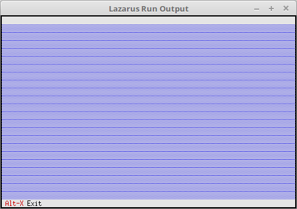

# 01 - Introduction
## 05 - First Desktop



Minimal FreeVision Application

---
Program name, as is customary in Pascal.

```pascal
program Project1;

```

For FreeVision to be possible at all, the **App** unit must be included.

```pascal
uses
App; // TApplication
```

Declaration for the FreeVision application.

```pascal
var
MyApp: TApplication;

```

The three steps are always necessary for execution.

```pascal
begin
MyApp.Init; // Initialize
MyApp.Run; // Execute
MyApp.Done; // Release
end.

```
