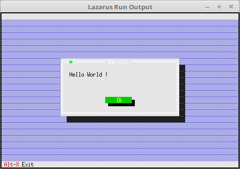

# 01 - Introduction
## 10 - Hello World



A Hello World with FreeVision.

The text is displayed in a message box.

---

```pascal
program Project1;

uses

App, MsgBox;

var

MyApp: TApplication;

begin

MyApp.Init;

MessageBox('Hello World!', nil, mfOKButton);

// MyApp.Run; // To continue.

MyApp.Done;

end.

```
