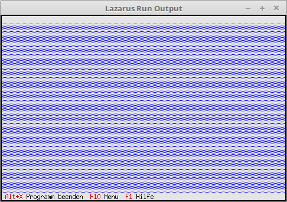

# 02 - Status Line and Menu
## 05 - Status Line with Multiple Entries



Changing the status line with multiple options.

--- Multiple hotkeys are also possible in the status line.

The declaration could be nested on a single line.

In this example, it's done in a split format.

```pascal

procedure TMyApp.InitStatusLine;

var

R: TRect; // Rectangle for the status line position.

P0: PStatusDef; // Pointer to the entire entry.

P1, P2, P3: PStatusItem; // Pointer to the individual hotkeys.

begin

GetExtent(R); // Returns the size/position of the app, typically 0, 0, 80, 24.

R.A.Y := R.B.Y - 1; // Position of the status bar, set to the bottom line of the app.

P3 := NewStatusKey('~F1~ Help', kbF1, cmHelp, nil);

P2 := NewStatusKey('~F10~ Menu', kbF10, cmMenu, P3);

P1 := NewStatusKey('~Alt+X~ Exit Program', kbAltX, cmQuit, P2);

P0 := NewStatusDef(0, $FFFF, P1, nil);

StatusLine := New(PStatusLine, Init(R, P0));

end;

```

The declaration and execution remain the same.

```pascal
var
MyApp: TMyApp;

begin
MyApp.Init; // Initialize
MyApp.Run; // Execute
MyApp.Done; // Release
end.

```
