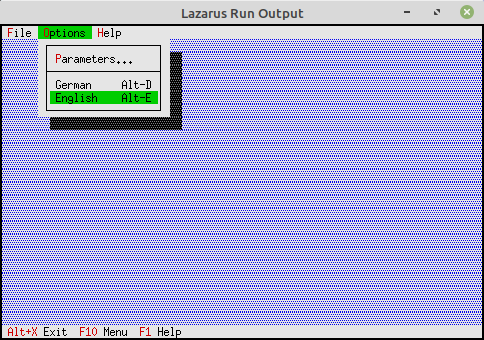

# 02 - Status Bar and Menu
## 35 - Swapping Menu and Status Bar



You can swap the entire menu and status bar at runtime.
For example, to make the application multilingual.
To do this, the current component is removed and the new one inserted.
In this example, there is one German and one English component.

---
Component Declaration

```pascal

TMyApp = object(TApplication)
procedure InitStatusLine; virtual;                 // Status bar
procedure InitMenuBar; virtual;                    // Menu
procedure HandleEvent(var Event: TEvent); virtual; // Event handler

private

menuGer, menuEng: PMenuView;       // The two menus
StatusGer, StatusEng: PStatusLine; // The two status bars

end;

```

Initialize the two status bars.

```pascal

procedure TMyApp.InitStatusLine;

var

R: TRect;

begin

GetExtent(R);

R.A.Y := R.B.Y - 1;

/ Status line (German)

StatusGer := New(PStatusLine, Init(R, NewStatusDef(0, $FFFF,
NewStatusKey('~Alt+X~ Exit Program', kbAltX, cmQuit,
NewStatusKey('~F10~ Menu', kbF10, cmMenu,
NewStatusKey('~F1~ Help', kbF1, cmHelp, nil))), nil)));


// Status bar (English)

StatusEng := New(PStatusLine, Init(R, NewStatusDef(0, $FFFF,
NewStatusKey('~Alt+X~ Exit', kbAltX, cmQuit,
NewStatusKey('~F10~ Menu', kbF10, cmMenu,
NewStatusKey('~F1~ Help', kbF1, cmHelp, nil))), nil)));

StatusLine := StatusGer; // German by default

end;

```

Initialize the two menus.

```pascal

procedure TMyApp.InitMenuBar;

var

R: TRect;

begin

GetExtent(R);

R.B.Y := R.A.Y + 1;

// Menu German 
menuGer := New(PMenuBar, Init(R, NewMenu( 
NewSubMenu('~File', hcNoContext, NewMenu( 
NewItem('S~c~hliessen', 'Alt-F3', kbAltF3, cmClose, hcNoContext, 
NewLine( 
NewItem('~B~end', 'Alt-X', kbAltX, cmQuit, hcNoContext, nil)))), 
NewSubMenu('~Options', hcNoContext, NewMenu( 
NewItem('~Parameter...', '', kbF2, cmPara, hcNoContext, 
NewLine( 
NewItem('~D~eutsch', 'Alt-D', kbAltD, cmMenuGerman, hcNoContext, 
NewItem('~English', 'Alt-E', kbAltE, cmMenuEnlish, hcNoContext, nil))))), 
NewSubMenu('~Help', hcNoContext, NewMenu( 
NewItem('~A~bout...', '', kbNoKey, cmAbout, hcNoContext, nil)), nil)))))); 

// Menu in English 
menuEng := New(PMenuBar, Init(R, NewMenu( 
NewSubMenu('~F~ile', hcNoContext, NewMenu( 
NewItem('~C~lose', 'Alt-F3', kbAltF3, cmClose, hcNoContext, 
NewLine( 
NewItem('E~x~it', 'Alt-X', kbAltX, cmQuit, hcNoContext, nil)))), 
NewSubMenu('~O~ptions', hcNoContext, NewMenu( 
NewItem('~P~arameters...', '', kbF2, cmPara, hcNoContext, 
NewLine( 
NewItem('German', 'Alt-D', kbAltD, cmMenuGerman, hcNoContext, 
NewItem('English', 'Alt-E', kbAltE, cmMenuEnlish, hcNoContext, nil))))),

NewSubMenu('~H~elp', hcNoContext, NewMenu(
NewItem('~A~bout...', '', kbNoKey, cmAbout, hcNoContext, nil)), nil))))));

MenuBar := menuGer; // German by default
end;

```

Replacing the components

```pascal

procedure TMyApp.HandleEvent(var Event: TEvent);

var
Rect: TRect; // Rectangle for the status bar position.

begin

GetExtent(Rect);

Rect.A.Y := Rect.B.Y - 1;

inherited HandleEvent(Event);

if Event.What = evCommand then begin

case Event.Command of
cmAbout: begin

/ An About dialog

end;

// Menu in English

cmMenuEnlish: begin

/ Swap menus

Delete(MenuBar); // Remove old menu

MenuBar := menuEng; // Assign new menu

Insert(MenuBar); // Insert new menu

/ Swap status lines

Delete(StatusLine); // Remove old status line

StatusLine := StatusEng; // Assign new status line

Insert(StatusLine); // Insert new status line

end;

/ Menu in German

cmMenuGerman: begin

Delete(MenuBar);

MenuBar := menuGer;

Insert(MenuBar);

Delete(StatusLine);

StatusLine := StatusGer;

Insert(StatusLine);

end;

cmPara: begin

/ A parameter dialog

end;

else begin

Exit;

end;

end;

ClearEvent(Event);

end;

```
