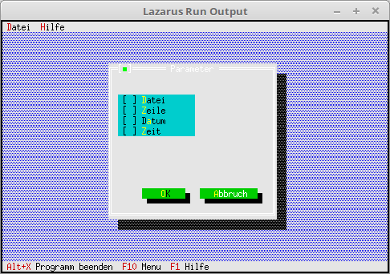

# 03 - Dialogues
## 15 - CheckBoxes



Add checkboxes to the dialog.

---
Supplement the dialogue with check boxes.

```pascal 
procedure TMyApp.MyParameter; 
var 
Dlg: PDialog; 
R: TRect; 
dummy: word; 
View: PView; 
begin 
R.Assign(0, 0, 35, 15); 
R.Move(23, 3); 
Dlg := New(PDialog, Init(R, 'Parameter')); 
with Dlg^ do begin 

// CheckBoxes 
R.Assign(4, 3, 18, 7); 
View := New(PCheckBoxes, Init(R, 
NewSItem('~File', 
NewSItem('~row~row', 
NewSItem('D~a~tum', 
NewSItem('~Time~', 
nil)))))); 
Insert(View); 

// Ok button 
R.Assign(7, 12, 17, 14); 
Insert(new(PButton, Init(R, '~O~K', cmOK, bfDefault))); 

// Close button 
R.Assign(19, 12, 32, 14); 
Insert(new(PButton, Init(R, '~A~abort', cmCancel, bfNormal))); 
end; 
dummy := Desktop^.ExecView(Dlg); // Open dialog modal. 
Dispose(Dlg, Done); // Free up dialog and memory. 
end;
```
