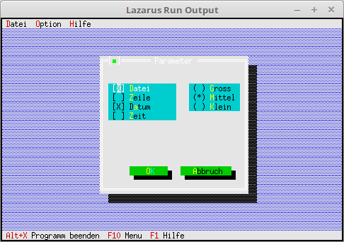

# 03 - Dialogues
## 20 - Radio Button



Add radio buttons to the dialog.

---
The menu has been changed/added a little.

```pascal 
procedure TMyApp.InitMenuBar; 
var 
R: TRect; // Rectangle for the menu line position. 

M: PMenu; // Entire menu 
SM0, SM1, SM2, // Submenu 
M0_0, M0_2, M0_3, M0_4, M0_5, 
M1_0, M2_0: PMenuItem; // Simple menu items 

begin 
GetExtent(R); 
R.B.Y := R.A.Y + 1; 

M2_0 := NewItem('~A~bout...', '', kbNoKey, cmAbout, hcNoContext, nil); 
SM2 := NewSubMenu('~Help', hcNoContext, NewMenu(M2_0), nil); 

M1_0 := NewItem('~Parameter...', '', kbF2, cmPara, hcNoContext, nil); 
SM1 := NewSubMenu('~O~ption', hcNoContext, NewMenu(M1_0), SM2); 

M0_5 := NewItem('~B~end', 'Alt-X', kbAltX, cmQuit, hcNoContext, nil); 
M0_4 := NewLine(M0_5); 
M0_3 := NewItem('S~c~hliessen', 'Alt-F3', kbAltF3, cmClose, hcNoContext, M0_4); 
M0_2 := NewLine(M0_3); 
M0_0 := NewItem('~L~iste', 'F2', kbF2, cmList, hcNoContext, M0_2); 
SM0 := NewSubMenu('~File', hcNoContext, NewMenu(M0_0), SM1); 

M := NewMenu(SM0); 

MenuBar := New(PMenuBar, Init(R, M)); 
end;
```

Add a radio button to the dialog, this works almost the same as with the check boxes.

```pascal 
procedure TMyApp.MyParameter; 
var 
Dlg: PDialog; 
R: TRect; 
dummy: word; 
View: PView; 
begin 
R.Assign(0, 0, 35, 15); 
R.Move(23, 3); 
Dlg := New(PDialog, Init(R, 'Parameter')); 
with Dlg^ do begin 

// CheckBoxes 
R.Assign(2, 3, 18, 7); 
View := New(PCheckBoxes, Init(R, 
NewSItem('~File', 
NewSItem('~row~row', 
NewSItem('D~a~tum', 
NewSItem('~Time~', 
nil)))))); 
Insert(View); 

// RadioButton 
R.Assign(21, 3, 33, 6); 
View := New(PRadioButtons, Init(R, 
NewSItem('~Big~ross', 
NewSItem('~Medium', 
NewSItem('~Small', 
nile))))); 
Insert(View); 

// Ok button 
R.Assign(7, 12, 17, 14); 
Insert(new(PButton, Init(R, '~O~K', cmOK, bfDefault))); 

// Close button 
R.Assign(19, 12, 32, 14); 
Insert(new(PButton, Init(R, '~A~abort', cmCancel, bfNormal))); 
end; 
dummy := Desktop^.ExecView(Dlg); // Open dialog modal. 
Dispose(Dlg, Done); // Free up dialog and memory. 
end;
```
