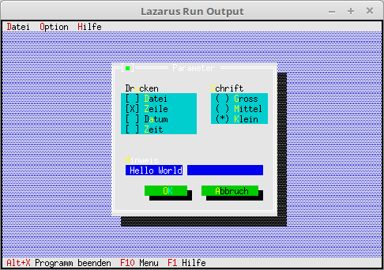

# 03 - Dialogues
## 30 - InputLine (edit line)



Insert an edit line.

---
Add a label to the check and radio group buttons.
This works almost the same as a normal label. The only difference is that instead of **nil** you enter the pointer to the group.

```pascal 
procedure TMyApp.MyParameter; 
var 
Dlg: PDialog; 
R: TRect; 
dummy: word; 
View: PView; 
begin 
R.Assign(0, 0, 35, 15); 
R.Move(23, 3); 
Dlg := New(PDialog, Init(R, 'Parameter')); 
with Dlg^ do begin 

// CheckBoxes 
R.Assign(2, 3, 18, 7); 
View := New(PCheckBoxes, Init(R, 
NewSItem('~File', 
NewSItem('~row~row', 
NewSItem('D~a~tum', 
NewSItem('~Time~', 
nil)))))); 
Insert(View); 
// Label for CheckGroup. 
R.Assign(2, 2, 10, 3); 
Insert(New(PLabel, Init(R, 'Press', View))); 

// RadioButton 
R.Assign(21, 3, 33, 6); 
View := New(PRadioButtons, Init(R, 
NewSItem('~Big~ross', 
NewSItem('~Medium', 
NewSItem('~Small', 
nile))))); 
Insert(View); 
// Label for RadioGroup. 
R.Assign(20, 2, 31, 3); 
Insert(New(PLabel, Init(R, '~Font', View))); 

// Edit line 
R.Assign(3,10,32,11); 
View:=New(PInputLine,Init(R,50)); 
Insert(View); 
// Label for edit line 
R.Assign(2,9,10,10); 
Insert(New(PLabel,Init(R,'~H~inweis',View))); 

// Ok button 
R.Assign(7, 12, 17, 14); 
Insert(new(PButton, Init(R, '~O~K', cmOK, bfDefault))); 

// Close button 
R.Assign(19, 12, 32, 14); 
Insert(new(PButton, Init(R, '~A~abort', cmCancel, bfNormal))); 
end; 
dummy := Desktop^.ExecView(Dlg); // Open dialog modal. 
Dispose(Dlg, Done); // Free up dialog and memory. 
end;
```
