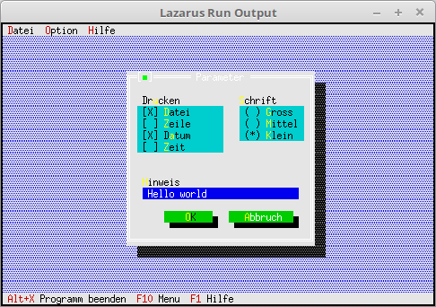

# 03 - Dialogues
## 35 - Remember values in the dialogue



Until now, the values in the dialogue were always lost whenever it was closed and reopened.
For this reason, the values ​​are now saved in a record.

--- 
The values of the dialog are stored in this record. 
The order of the data in the record **must** be exactly the same as when the components were created, otherwise there will be a crash. 
With Turbo Pascal a **Word** had to be used instead of **LongWord**, this is important when porting old applications.

```pascal
type.type 
TParameterData = record 
pressure, 
font: longword; 
Note: string[50]; 
end;
```

Here the constructor is inherited; this descendant is needed to load the dialog data with standard values.

```pascal
type.type 
TMyApp = object(TApplication) 
ParameterData: TParameterData; // Data for parameter dialog 
constructor Init; // New constructor 

procedure InitStatusLine; virtual; // Status line 
procedure InitMenuBar; virtual; // Menu 
procedure HandleEvent(var Event: TEvent); virtual; // event handler 

procedure MyParameter; // new function for a dialog. 
end;
```

The constructor that loads the values for the dialog.
The data structure for the RadioButtons is simple. 0 is the first button, 1 is the second, 2 is the third, etc.
When it comes to checkboxes, it's best to do it in binary. In the example, the first and third CheckBox are set.

```pascal 
constructor TMyApp.Init; 
begin 
inherited Init; // Call ancestor 
with ParameterData do begin 
pressure := %0101; 
font := 2; 
Note := 'Hello world'; 
end; 
end;
```

The dialog is now loaded with values.
You do this as soon as you have finished creating components.

```pascal 
procedure TMyApp.MyParameter; 
var 
Dlg: PDialog; 
R: TRect; 
dummy: word; 
View: PView; 
begin 
R.Assign(0, 0, 35, 15); 
R.Move(23, 3); 
Dlg := New(PDialog, Init(R, 'Parameter')); 
with Dlg^ do begin 

// CheckBoxes 
R.Assign(2, 3, 18, 7); 
View := New(PCheckBoxes, Init(R, 
NewSItem('~File', 
NewSItem('~row~row', 
NewSItem('D~a~tum', 
NewSItem('~Time~', 
nil)))))); 
Insert(View); 
// Label for CheckGroup. 
R.Assign(2, 2, 10, 3); 
Insert(New(PLabel, Init(R, 'Press', View))); 

// RadioButton 
R.Assign(21, 3, 33, 6); 
View := New(PRadioButtons, Init(R, 
NewSItem('~Big~ross', 
NewSItem('~Medium', 
NewSItem('~Small', 
nile))))); 
Insert(View); 
// Label for RadioGroup. 
R.Assign(20, 2, 31, 3); 
Insert(New(PLabel, Init(R, '~Font', View))); 

// Edit line 
R.Assign(3, 10, 32, 11); 
View := New(PInputLine, Init(R, 50)); 
Insert(View); 
// Label for edit line 
R.Assign(2, 9, 10, 10); 
Insert(New(PLabel, Init(R, '~H~inweis', View))); 

// Ok button 
R.Assign(7, 12, 17, 14); 
Insert(new(PButton, Init(R, '~O~K', cmOK, bfDefault))); 

// Close button 
R.Assign(19, 12, 32, 14); 
Insert(new(PButton, Init(R, '~A~abort', cmCancel, bfNormal))); 
end; 
Dlg^.SetData(ParameterData); // Load dialog with the values. 
dummy := Desktop^.ExecView(Dlg); // Execute dialog. 
if dummy = cmOK then begin // If you end the dialog with Ok, then load data from the dialog into Record. 
Dlg^.GetData(ParameterData); 
end; 

Dispose(Dlg, Done); // Free up dialog and memory. 
end;
```
