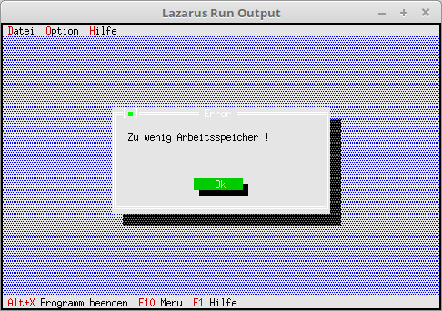

# 03 - Dialogues
## 40 - Check free memory



Check whether there is enough memory free to create the dialog.
On today's computers it will probably no longer be the case that the memory overflows because of a dialog.

---
The virtual procedure **OutOfMemory**, when the memory overflows.
If you don't overwrite this method, no error message will be output, but the user won't know why their view doesn't appear.

```pascal
type.type 
TMyApp = object(TApplication) 
ParameterData: TParameterData; // Parameters for dialog. 
constructor Init; // New constructor 

procedure InitStatusLine; virtual; // Status line 
procedure InitMenuBar; virtual; // Menu 
procedure HandleEvent(var Event: TEvent); virtual; // event handler 
procedure OutOfMemory; virtual; // Called when memory overflows. 

procedure MyParameter; // new function for a dialog. 
end;
```

The procedure is called when there is not enough memory available.

```pascal 
procedure TMyApp.OutOfMemory; 
begin 
MessageBox('Too little memory !', nil, mfError + mfOkButton); 
end;
```

The dialog is now loaded with values.
You do this as soon as you have finished creating components.
With **ValidView(...** you check whether there is enough memory available to create the component.
If not, **nil<(b> comes back. It doesn't matter whether you overwrite **OutOfMemory**.

```pascal 
procedure TMyApp.MyParameter; 
var 
Dlg: PDialog; 
R: TRect; 
dummy: word; 
View: PView; 
begin 
R.Assign(0, 0, 35, 15); 
R.Move(23, 3); 
Dlg := New(PDialog, Init(R, 'Parameter')); 
with Dlg^ do begin 

// CheckBoxes 
R.Assign(2, 3, 18, 7); 
View := New(PCheckBoxes, Init(R, 
NewSItem('~File', 
NewSItem('~row~row', 
NewSItem('D~a~tum', 
NewSItem('~Time~', 
nil)))))); 
Insert(View); 
// Label for CheckGroup. 
R.Assign(2, 2, 10, 3); 
Insert(New(PLabel, Init(R, 'Press', View))); 

// RadioButton 
R.Assign(21, 3, 33, 6); 
View := New(PRadioButtons, Init(R, 
NewSItem('~Big~ross', 
NewSItem('~Medium', 
NewSItem('~Small', 
nile))))); 
Insert(View); 
// Label for RadioGroup. 
R.Assign(20, 2, 31, 3); 
Insert(New(PLabel, Init(R, '~Font', View))); 

// Edit line 
R.Assign(3, 10, 32, 11); 
View := New(PInputLine, Init(R, 50)); 
Insert(View); 
// Label for edit line 
R.Assign(2, 9, 10, 10); 
Insert(New(PLabel, Init(R, '~H~inweis', View))); 

// Ok button 
R.Assign(7, 12, 17, 14); 
Insert(new(PButton, Init(R, '~O~K', cmOK, bfDefault))); 

// Close button 
R.Assign(19, 12, 32, 14); 
Insert(new(PButton, Init(R, '~A~abort', cmCancel, bfNormal))); 
end; 
if ValidView(Dlg) <> nil then begin // Check whether there is enough memory. 
Dlg^.SetData(ParameterData); // Load dialog with the values. 
dummy := Desktop^.ExecView(Dlg); // Execute dialog. 
if dummy = cmOK then begin // If you end the dialog with Ok, then load data from the dialog into Record. 
Dlg^.GetData(ParameterData); 
end; 

Dispose(Dlg, Done); // Free up dialog and memory. 
end; 
end;
```
