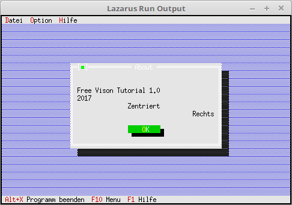

# 03 - Dialogues
## 50 - StaticText good for an About



An about dialog is created here, which shows clearly what labels can be used for.

---
The file in which the data for the dialog is located.

```pascal
const 
DialogFile = 'parameter.cfg';
```

A new function **About** has been added.

```pascal
type.type 
TMyApp = object(TApplication) 
ParameterData: TParameterData; // Parameters for dialog. 
fParameterData: file of TParameterData; // File hander for saving/loading the dialog data. 

constructor Init; // New constructor 

procedure InitStatusLine; virtual; // Status line 
procedure InitMenuBar; virtual; // Menu 
procedure HandleEvent(var Event: TEvent); virtual; // event handler 
procedure OutOfMemory; virtual; // Called when memory overflows. 

procedure MyParameter; // new function for a dialog. 
procedure About; // About Dialog. 
end;
```

Here the About is called, which is selected in the About menu.

```pascal 
procedure TMyApp.HandleEvent(var Event: TEvent); 
begin 
inherited HandleEvent(Event); 

if Event.What = evCommand then begin 
case Event.Command of 
cmAbout: begin 
About; // Call About dialog 
end; 
cmList: begin 
end; 
cmPara: begin 
MyParameters; 
end; 
else begin 
exit; 
end; 
end; 
end; 
ClearEvent(Event); 
end;
```

Create About Dialog.
With **TRext.Grow(...** you can shrink and enlarge the rect.
You can insert a line break with **#13**.
Using **#3** will center the text horizontally in the rect.
With **#2** the text is written right-aligned.

You could also output text with **PLabel**, but **PStaticText** is better for fixed text.

```pascal 
procedure TMyApp.About; 
var 
Dlg: PDialog; 
R: TRect; 
begin 
R.Assign(0, 0, 42, 11); 
R.Move(1, 1); 
Dlg := New(PDialog, Init(R, 'About')); 
with Dlg^ do begin 
Options := Options or ofCentered; // Center dialog 

// Insert StaticText. 
R.Assign(2, 2, 40, 8); 
Insert(New(PStaticText, Init(R, 
#13+ 
'Free Vision Tutorial 1.0' + #13 + 
'2017' + #13 + 
#3 + 'Centered' + #13 + 
#2 + 'Right'))); 
R.Assign(16, 8, 26, 10); 
Insert(New(PButton, Init(R, '~O~K', cmOK, bfDefault))); 
end; 
if ValidView(Dlg) <> nil then begin 
Desktop^.ExecView(Dlg); // Call modal, function result is not evaluated. 
Dispose(Dlg, Done); // Release dialog. 
end; 
end;
```
