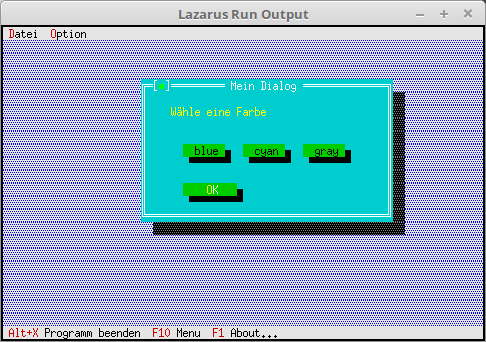

# 04 - Dialogs as Components
## 15 - Different Dialog Colors



Different color schemes can be assigned to a window/dialog.

The following is used by default:

```pascal
Editor window: Blue
Dialog: Gray
Help window: Cyan
```

Without any action, the windows/dialogs always appear in the correct color.

Modification is only useful in special cases.

---
**Unit with the new dialog.**

The three buttons at the top allow you to change the dialog's color scheme.

```pascal
unit MyDialog;

```

Three event constants have been added here.

```pascal
type
PMyDialog = ^TMyDialog;

TMyDialog = object(TDialog)
CounterButton: PButton; // Button with counter.

constructor Init;

procedure HandleEvent(var Event: TEvent); virtual;

end;

```

Building the dialog is nothing special.

```pascal
const

cmBlue = 1006;

cmCyan = 1007;

cmGray = 1008;

constructor TMyDialog.Init;

var
R: TRect;

begin

R.Assign(0, 0, 42, 11);

R.Move(23, 3);

inherited Init(R, 'My Dialog');

/ StaticText

R.Assign(5, 2, 41, 8);

Insert(new(PStaticText, Init(R, 'W' + #132 + 'choose a color')));

// Color

R.Assign(7, 5, 15, 7);

Insert(new(PButton, Init(R, 'blue', cmBlue, bfNormal)));

R.Assign(17, 5, 25, 7);

Insert(new(PButton, Init(R, 'cyan', cmCyan, bfNormal)));

R.Assign(27, 5, 35, 7);

Insert(new(PButton, Init(R, 'gray', cmGray, bfNormal)));

// OK Button

R.Assign(7, 8, 17, 10);

Insert(new(PButton, Init(R, '~O~K', cmOK, bfDefault)));

end;

```

Here, the color schemes are changed using **Palette := dpxxx**. Here too, it's important to call **Draw**, this time not for a single component, but for the entire dialog.

``pascal
procedure TMyDialog.HandleEvent(var Event: TEvent);

begin

inherited HandleEvent(Event); // Call the ancestor.

case Event.What of

evCommand: begin

case Event.Command of
cmBlue: begin
Palette := dpBlueDialog; // Assign the palette, here blue.

Draw; // Redraw the dialog.

ClearEvent(Event); // The event is complete.

end;

cmCyan: begin
Palette := dpCyanDialog;

Draw;

ClearEvent(Event);

end;

cmGray: begin
Palette := dpGrayDialog;

Draw;

ClearEvent(Event);

end; ... ```
